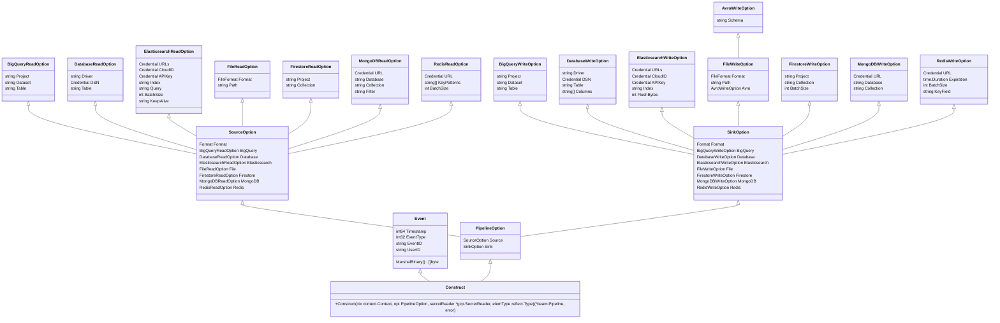

```mermaid
classDiagram
    class Event {
        int64 Timestamp
        int32 EventType
        string EventID
        string UserID
        MarshalBinary() []byte
    }

    class PipelineOption {
        SourceOption Source
        SinkOption Sink
    }

    class SourceOption {
        Format Format
        BigQueryReadOption BigQuery
        DatabaseReadOption Database
        ElasticsearchReadOption Elasticsearch
        FileReadOption File
        FirestoreReadOption Firestore
        MongoDBReadOption MongoDB
        RedisReadOption Redis
    }

    class SinkOption {
        Format Format
        BigQueryWriteOption BigQuery
        DatabaseWriteOption Database
        ElasticsearchWriteOption Elasticsearch
        FileWriteOption File
        FirestoreWriteOption Firestore
        MongoDBWriteOption MongoDB
        RedisWriteOption Redis
    }

    class BigQueryReadOption {
        string Project
        string Dataset
        string Table
    }

    class DatabaseReadOption {
        string Driver
        Credential DSN
        string Table
    }

    class ElasticsearchReadOption {
        Credential URLs
        Credential CloudID
        Credential APIKey
        string Index
        string Query
        int BatchSize
        string KeepAlive
    }

    class FileReadOption {
        FileFormat Format
        string Path
    }

    class FirestoreReadOption {
        string Project
        string Collection
    }

    class MongoDBReadOption {
        Credential URL
        string Database
        string Collection
        string Filter
    }

    class RedisReadOption {
        Credential URL
        string[] KeyPatterns
        int BatchSize
    }

    class BigQueryWriteOption {
        string Project
        string Dataset
        string Table
    }

    class DatabaseWriteOption {
        string Driver
        Credential DSN
        string Table
        string[] Columns
    }

    class ElasticsearchWriteOption {
        Credential URLs
        Credential CloudID
        Credential APIKey
        string Index
        int FlushBytes
    }

    class FileWriteOption {
        FileFormat Format
        string Path
        AvroWriteOption Avro
    }

    class AvroWriteOption {
        string Schema
    }

    class FirestoreWriteOption {
        string Project
        string Collection
        int BatchSize
    }

    class MongoDBWriteOption {
        Credential URL
        string Database
        string Collection
    }

    class RedisWriteOption {
        Credential URL
        time.Duration Expiration
        int BatchSize
        string KeyField
    }

    class Construct {
        +Construct(ctx context.Context, opt PipelineOption, secretReader *gcp.SecretReader, elemType reflect.Type) (*beam.Pipeline, error)
    }

    Event <|-- Construct
    PipelineOption <|-- Construct
    SourceOption <|-- PipelineOption
    SinkOption <|-- PipelineOption
    BigQueryReadOption <|-- SourceOption
    DatabaseReadOption <|-- SourceOption
    ElasticsearchReadOption <|-- SourceOption
    FileReadOption <|-- SourceOption
    FirestoreReadOption <|-- SourceOption
    MongoDBReadOption <|-- SourceOption
    RedisReadOption <|-- SourceOption
    BigQueryWriteOption <|-- SinkOption
    DatabaseWriteOption <|-- SinkOption
    ElasticsearchWriteOption <|-- SinkOption
    FileWriteOption <|-- SinkOption
    FirestoreWriteOption <|-- SinkOption
    MongoDBWriteOption <|-- SinkOption
    RedisWriteOption <|-- SinkOption
    AvroWriteOption <|-- FileWriteOption
```
